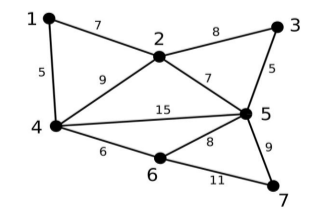
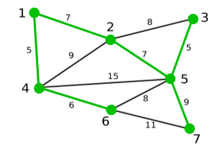
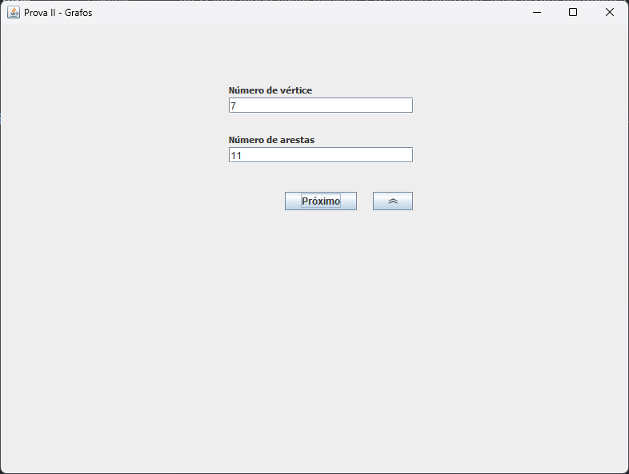
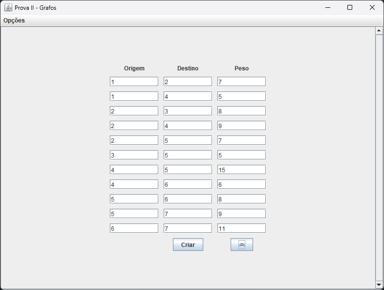
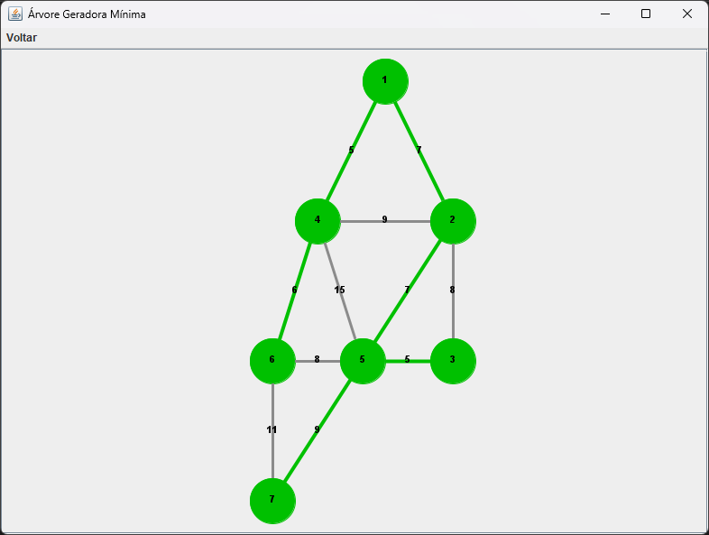
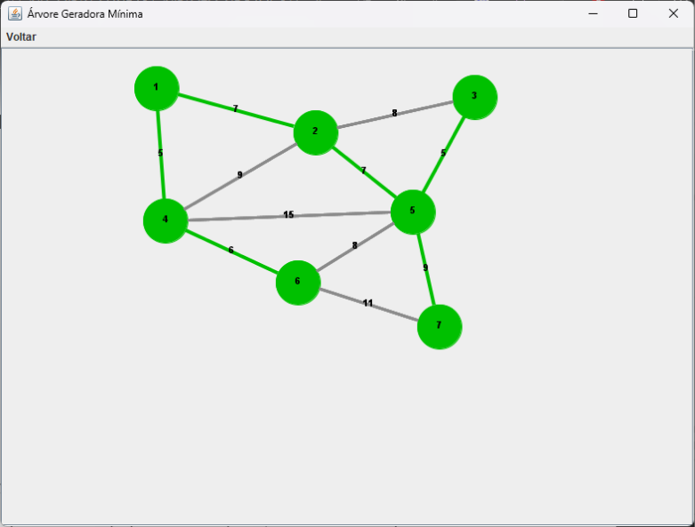

## Trabalho Final - Teoria dos Grafos

### Especificação do Trabalho

O prefeito de determinada cidade está planejando melhorias para a população local. Entre as
melhorias propostas, está o recapeamento de diversas ruas. Conversando com sua equipe de TI, o prefeito
descobriu estar diante de um problema clássico da computação: **árvore geradora mínima**.

Suponha que a cidade seja modelada por meio de um grafo G = (V, A), conforme ilustrado na
Figura 1, onde cada vértice representa um bairro e cada aresta representa uma rua conectando dois bairros
(o peso representa a distância em Km). Uma árvore geradora mínima de G é qualquer árvore
geradora de G que tenha custo mínimo. Em outras palavras, uma árvore geradora T de G é mínima se
nenhuma outra árvore geradora tem custo estritamente menor que o de T. Árvores geradoras mínimas
também são conhecidas pela abreviatura MST de minimum spanning tree.

   
  
Figura 1: Exemplo de representação da cidade. Os vértices correspondem aos bairros e as arestas às ruas que conectam esses bairros.

O prefeito verificou que o orçamento do ano está apertado e, por isso, foi decidido que será
necessário economizar no recapeamento das ruas. Assim, deseja-se ao menos garantir que todos os
bairros estejam conectados entre si por meio de ruas em boas condições. Em outras palavras, deve ser
possível partir de um bairro e chegar aos demais por meio de ruas em boas condições. A Figura 2 mostra
quais seriam as ruas recapeadas pelo prefeito.

   
  
Figura 2: Mapa das ruas recapadas (em verde)

### Tarefa

Escreva um programa que auxilie o prefeito na tomada de decisões. Ao ser executado, o programa
deve apresentar as ruas que precisam ser recapeadas, levando em consideração a necessidade de manter
o grafo conexo. Utilize como estrutura de dados para a conectividade dos vértices uma lista de adjacência.
Para o problema de árvore geradora mínima, utilize o algoritmo de **Kruskal**.

### Exemplo de entrada
A entrada do programa será o número de vértices seguido do número de arestas, seguidos das arestas que
representam a conexão entre dois dispositivos e seus respectivos pesos.
A entrada do programa segue o seguinte formato:
<pre>
número de vértices
número de arestas
u1 v1 p1
u2 v2 p2
...
um vm pm
</pre>

## Screenshots
Por exemplo, para o grafo da Figura 1, temos:

